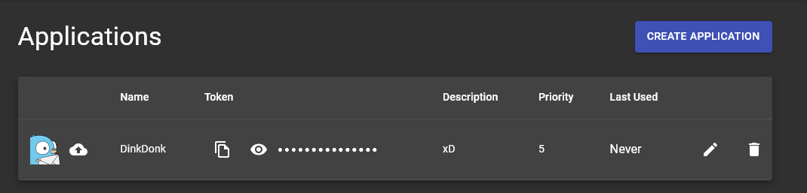
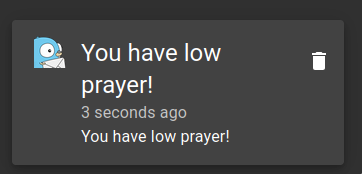

# Push Notifications
Send notifications to your phone or other devices, currently supports [Pushbullet](https://www.pushbullet.com/), [Pushover](https://pushover.net/) and [Gotify](https://gotify.net).

## Pushbullet
You need to provide a pushbullet api key to use this service.
Go [here](https://www.pushbullet.com/#settings) and click create new token or use your existing one.

The generated key will be in the format `o.Dorf43jdDIepfKeroPewfjeIUHJ4MrOP`.

Open your client and paste the key into the `Pushbullet` config field of `Push Notifications` to enable phone notifications.

## Pushover
You need to provide both a pushover user key and api token to use this service.

Go [here](https://pushover.net/), login and your user key will be in the top right of the page.

To get an api key, click `Create an Application/API Token`, enter a name for the application such as `Runelite` and click `Create Application`.

Your api key will then be displayed at the top of the page.

Copy and paste both the user key and api token into there respective fields under the `Pushover` section to enable notifications.

## Gotify
[Gotify](https://gotify.net/) is a self-hosted push notification service.

You need to provide a Gotify server URL, application token and priority.

Gotify server URL format: `http://10.0.0.30:8080/message`

Gotify token can be created under `Apps/Create Application`

Example notification

